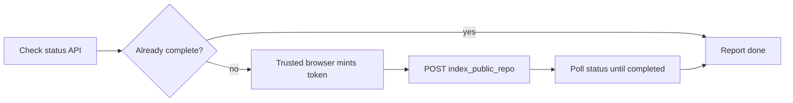

<div align="center">

# DeepWiki Index

**DeepWiki indexing** for Claude Code — autonomously index public GitHub repos so the Ask DeepWiki badge resolves, using the verified API trigger and a trusted browser for silent reCAPTCHA.

[](https://github.com/88plug/deepwiki-index/actions/workflows/plugin-validate.yml)
[](./LICENSE)
[](https://88plug.github.io/deepwiki-index/)
[](https://github.com/88plug/claude-code-plugins)
[](https://deepwiki.com/88plug/deepwiki-index)

</div>

deepwiki-index is a Claude Code skill and CLI helper for DeepWiki documentation
indexing. After you publish a public repo or add the badge, the agent triggers
indexing hands-free, mints the reCAPTCHA token in a trusted browser, and polls
the public status API until the wiki is ready. It is for developers and AI
agents who want batch-processing of repo wikis without re-researching Devin's
public endpoints.

## Install

```text
/plugin marketplace add 88plug/claude-code-plugins
/plugin install deepwiki-index@88plug
```

No config file is required. Manual and batch runs of the helper need Playwright
(see [Manual / batch use](#manual--batch-use)).

## Quickstart

1. Install the plugin (above).
2. Publish a public GitHub repo, or add the DeepWiki badge to an existing one.
3. Ask the agent, or let it auto-trigger:

```text
Index the DeepWiki for this repo.
```

4. Wait for the status poll. Indexing usually finishes in **2–10 minutes**.
5. Open `https://deepwiki.com/<owner>/<repo>` — the wiki should load and the
   badge should resolve.

> [!TIP]
> Prefer a **trusted local browser** (your real Chrome profile, or
> [screen-mcp](https://github.com/88plug/screen-mcp) driving the desktop).
> Silent reCAPTCHA minting depends on that context.

## Features

| Capability | Detail |
|---|---|
| Autonomous indexing | Agent runs without asking after publish, badge add, or "index the wiki" |
| Verified trigger | Encodes `api.devin.ai` DeepWiki endpoints — no re-research each session |
| Trusted-browser token | screen-mcp desktop path or Playwright + real Chrome profile |
| Status polling | Public API only; success means `completed` / `indexed`, not a button click |
| Batch processing | One repo, comma-list, or full 88plug marketplace set (`REPO=all`) |
| One-time bootstrap | DeepWiki re-crawls after the first index — not a per-commit CI job |

## When it auto-triggers

The skill description tells the agent to run **without asking** when any of
these apply:

| Situation | What the agent does |
|---|---|
| You **publish a new public repo** | Checks status, triggers index if needed, polls to `completed` |
| You **add the "Ask DeepWiki" badge** | Same flow so the badge target exists |
| You say **"index the wiki"**, **"make the badge work"**, or **"index the deepwiki repos"** | Indexes the current repo, a named list, or a batch |
| **Major changes** and you want a refresh | Re-triggers when status is not already complete |
| **Batch** of public repos | Runs the helper with `REPO=…` or `REPO=all` |

It will **not** treat indexing as a per-commit job. After the first successful
index, DeepWiki re-crawls on its own.

> [!NOTE]
> Private repos are out of scope. Those need a Devin org account. This plugin
> only covers **public** GitHub repos via the public DeepWiki APIs.

## What it does

Once installed, the agent:

1. **Checks status** via the public status API.
2. If not already done, **triggers indexing** through a trusted browser path.
3. **Polls** until status is complete (or times out).
4. **Reports the real API result** — never claims "indexed" from a click alone.

Two execution paths (agent picks in order of preference):

| Path | When | How |
|---|---|---|
| **screen-mcp (real desktop)** | `screen-mcp` is connected | Opens `https://deepwiki.com/<owner>/<repo>`, fills notify email, clicks **Index Repository** |
| **Bundled Playwright helper** | Local Chrome / Chromium available | `scripts/index-deepwiki.mjs` mints the invisible token in-page and POSTs the trigger |

## How indexing works

DeepWiki builds a browsable wiki for a public GitHub repo. The Ask DeepWiki
badge points at `https://deepwiki.com/<owner>/<repo>` — useful only after one
successful index. The skill encodes the verified public API:

| Step | Endpoint |
|---|---|
| **Trigger** | `POST https://api.devin.ai/ada/index_public_repo?repo_name=<owner/repo>&email_to_notify=<email>&recaptcha_token=<tok>` |
| **Status** (open, no auth) | `GET https://api.devin.ai/ada/public_repo_indexing_status?repo_name=<owner/repo>` |

Status values include `unknown`, `indexing`, and `completed` (the helper also
treats synonyms such as `indexed` / `ready` as done).



### reCAPTCHA and the trusted browser

The trigger requires a **reCAPTCHA v2 invisible** token. Without it the API
returns `400` (`reCAPTCHA validation failed`). The site key is bound to
`deepwiki.com`.

- On a **trusted browser** (real desktop Chrome, or Chromium with your real
  user-data directory), the invisible widget mints a token with **no challenge
  UI**.
- On **datacenter, bare headless, or low-reputation** contexts, the same widget
  may show an image challenge. The skill **does not solve image challenges**.
  It fails clearly and hands you the command to run on a trusted machine.

Drive that browser via screen-mcp, or set `CHROME_USER_DATA_DIR` on the helper.

> [!IMPORTANT]
> Do not wire this into CI as a required job. CI cannot mint a silent token
> reliably. Index once from your machine after publish; DeepWiki maintains the
> wiki afterward.

## Manual / batch use

Install Playwright once, then run the helper from a clone of this repo (or from
`${CLAUDE_PLUGIN_ROOT}` when the plugin is installed):

```sh
npm i -D playwright && npx playwright install chromium

# current git remote (origin → owner/repo)
node scripts/index-deepwiki.mjs

# one or more repos
REPO=owner/name node scripts/index-deepwiki.mjs
REPO=a/b,c/d node scripts/index-deepwiki.mjs

# full 88plug marketplace set baked into the script
REPO=all node scripts/index-deepwiki.mjs
```

**Best success rate** — reuse your real Chrome profile so the captcha stays
silent:

```sh
CHROME_USER_DATA_DIR="$HOME/.config/google-chrome" \
  REPO=owner/name node scripts/index-deepwiki.mjs
```

### Environment variables

| Variable | Default | Meaning |
|---|---|---|
| `REPO` | current `origin` | `owner/name`, comma-list, or `all` |
| `EMAIL` | `notify@example.com` | Notify email on the trigger |
| `CHROME_USER_DATA_DIR` | _(empty)_ | Persistent Chrome profile for silent tokens |
| `HEADLESS` | off (`0`) | Set `1` for headless (often fails silent mint) |
| `INDEX_TIMEOUT_MS` | `720000` (12 min) | Per-repo poll deadline |

The helper logs HTTP status from the trigger, polls every ~15s, and exits `0`
only if every requested repo reaches a completed status.


## Troubleshooting

| Symptom | Likely cause | What to do |
|---|---|---|
| `400` / `reCAPTCHA validation failed` | Missing or rejected token | Real desktop browser or `CHROME_USER_DATA_DIR` set to your Chrome profile |
| `no silent token (untrusted/headless context)` | Headless / datacenter / cold Chromium | Unset headless; use your profile; or use screen-mcp |
| Image challenge appears | Untrusted context | Do not solve via the skill; switch to a trusted browser |
| Status stuck on `indexing` / poll timeout | DeepWiki still working, or lag | Wait and re-check; default window is 12 min (`INDEX_TIMEOUT_MS`) |
| Status `unknown` after trigger | Trigger may not have landed | Confirm POST success; retry once from a trusted browser |
| "No repo" from the helper | Not in a git repo and `REPO` unset | Set `REPO=owner/name` or run inside a clone with GitHub `origin` |
| Playwright import error | Playwright not installed | `npm i -D playwright && npx playwright install chromium` |
| Private repo | Public API only | Out of scope — needs a Devin org account |
| Badge still dead after "success" | Claimed success without API verify | Re-check status API; only trust `completed` / `indexed` |

### Check status yourself

```sh
curl -sS "https://api.devin.ai/ada/public_repo_indexing_status?repo_name=OWNER/REPO"
```

Expect JSON with a `status` field. Re-run the helper only when it is not already
complete.

### Close Chrome before using the profile

If Chrome is already running, profile locks can fail Playwright. Quit Chrome
first, copy the profile, or use screen-mcp on the open browser.

## Limits

- **Public repos only.**
- **One-time bootstrap per repo**, not a per-commit pipeline.
- **Trusted browser required** for the reCAPTCHA token.
- **No captcha-solving services** and no CI-only path.
- **Does not host or replace DeepWiki** — it only submits your public repo for
  indexing and waits until the public status API reports complete.

## Development

```sh
python3 .ci/validate_plugin.py .
bash tests/smoke.sh
# docs
pip install mkdocs mkdocs-material
mkdocs build --strict
```

Local clone is for development and manual helper runs only.

## License

[FSL-1.1-ALv2](./LICENSE). See the [changelog](./CHANGELOG.md).
